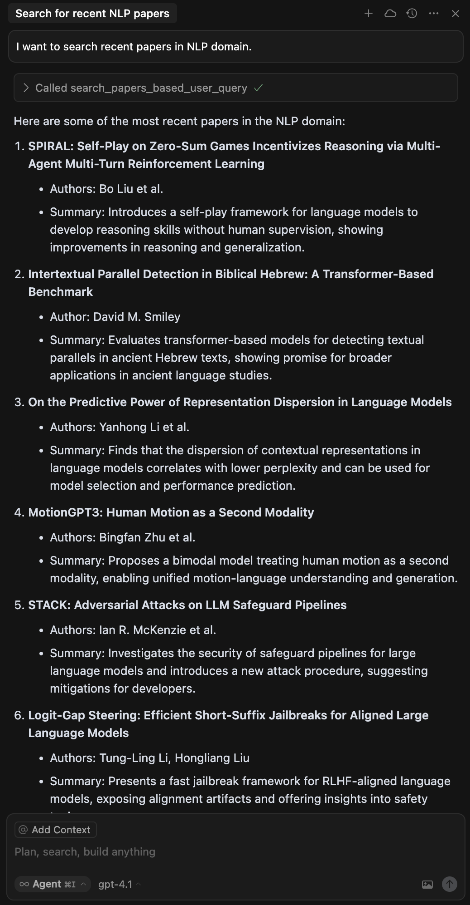

# Arxiv Paper MCP Server
MCP(Model Context Protocol) server can search papersfrom arxiv api.

## 1. Pre-Required
1. Google llm api key : This mcp server use google llm(gemini series). So generate google llm api key first.
2. Select using model : This mcp server initialize llm model by langchain's [init_chat_model](https://python.langchain.com/api_reference/langchain/chat_models/langchain.chat_models.base.init_chat_model.html) function. Follow this format **"{model_provider}:{model_name}"**; Example value "google_genai:gemini-2.0-flash".

## 2. Installation
### Cursor
```sh
uv sync

source .venv/bin/activate

# generate mcp.json setting
python -m src.setup.cursor \
    -e GOOGLE_API_KEY=<YOUR GOOGLE LLM API KEY> \
    -e USING_MODEL_INFO=<YOUR USING MODEL INFO> \
    -e MODEL_TEMPERATURE=0.0 \
    -e MODEL_SEED=256
```

## 3. Support Tool
### search_papers_based_user_query
Search papers from Arxiv API that user want to search.

**Example**
```
Q: I want to search recent papers in NLP domain.
```


## 4. License
This project is open source software licensed as MIT.
